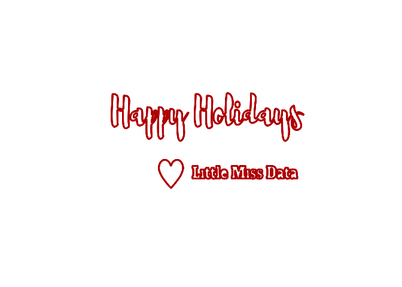
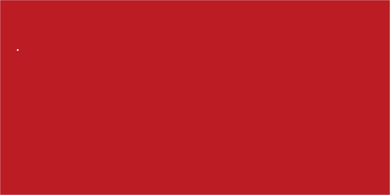

Load all packages
=================

``` r
library(data.table)
library(tidyverse)
```

    ## ── Attaching packages ─────────────────────────────────────────────────────────── tidyverse 1.2.1 ──

    ## ✔ ggplot2 3.2.0     ✔ purrr   0.3.2
    ## ✔ tibble  2.1.3     ✔ dplyr   0.8.3
    ## ✔ tidyr   0.8.3     ✔ stringr 1.4.0
    ## ✔ readr   1.3.1     ✔ forcats 0.4.0

    ## ── Conflicts ────────────────────────────────────────────────────────────── tidyverse_conflicts() ──
    ## ✖ dplyr::between()   masks data.table::between()
    ## ✖ dplyr::filter()    masks stats::filter()
    ## ✖ dplyr::first()     masks data.table::first()
    ## ✖ dplyr::lag()       masks stats::lag()
    ## ✖ dplyr::last()      masks data.table::last()
    ## ✖ purrr::transpose() masks data.table::transpose()

``` r
library(gganimate)
library(ggimage)
library(magick)
```

    ## Linking to ImageMagick 6.9.9.39
    ## Enabled features: cairo, fontconfig, freetype, lcms, pango, rsvg, webp
    ## Disabled features: fftw, ghostscript, x11

``` r
library(gifski)
```

Download the data
=================

Csv created with a tool called
[coordinator](https://spotify.github.io/coordinator/), by [Aliza
Aufrichtig](https://twitter.com/alizauf). It allows us to convert SVG
graphics to data co-ordinates

``` r
df= fread('https://raw.githubusercontent.com/lgellis/MiscTutorial/master/Holidays/Holidays.csv', stringsAsFactors = FALSE)
```

\#Create the Plot

Classic ggplot scatterplot. Remove all lines an chart aspects with
theme\_void. Increase the chart size beyond the plotted points using the
xlim() and ylim() functions. This will allow us to nicely center the
text on our background image.

``` r
# Basic scatter plot
p <-ggplot(df, aes(x=x, y=y)) +
  geom_point(colour = '#BF0000', size = 0.3) +
   xlim(0, 18000) +
   ylim(0, 10000) +
   theme_void()
p
```



Add the background Holiday Image
================================

Add the holiday background using the ggbackground funcion in the ggimage
package. I got this tip from a [great blog
post](https://guangchuangyu.github.io/2018/04/setting-ggplot2-background-with-ggbackground/)
by [Guangchuang Yu](https://guangchuangyu.github.io/)

``` r
img <- "https://raw.githubusercontent.com/lgellis/MiscTutorial/master/Holidays/%20background.jpg"
imgRead <- image_read(img)
ggbackground(p, img)
```


Animation
=========

Create the animation with the gganimate package. Use transition\_manual
vs transition\_reveal because it allows us to specify cumulative=TRUE to
keep all data already shown.

``` r
t <-ggplot(df, aes(x=x, y=y)) +
   theme_void() + 
   theme(plot.background = element_rect(fill = '#CA302F')) +
   geom_point(colour = 'white', size = 1) +
   transition_manual(as.numeric(x), cumulative=TRUE) 
```

Save a gif
==========

Use the gifski package to save the gif.

``` r
gif <- animate(t, end_pause = 25, width = 800, height = 400, fps = 8)
gif
```



``` r
anim_save("HappyHolidays.gif", gif)
```
