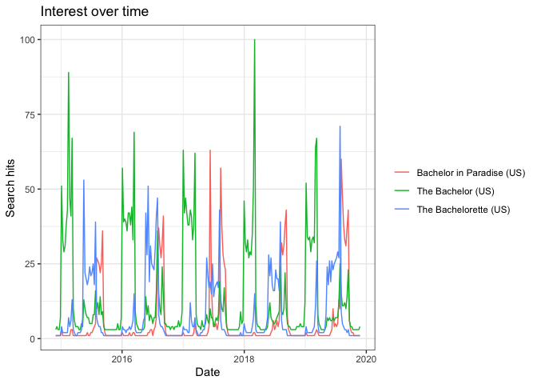
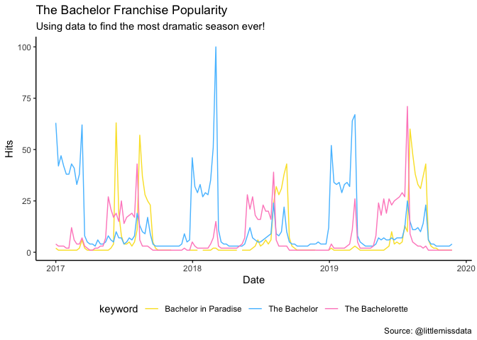
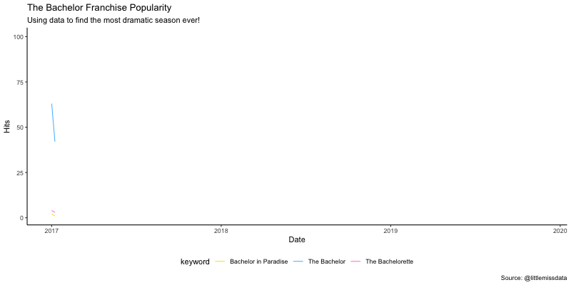
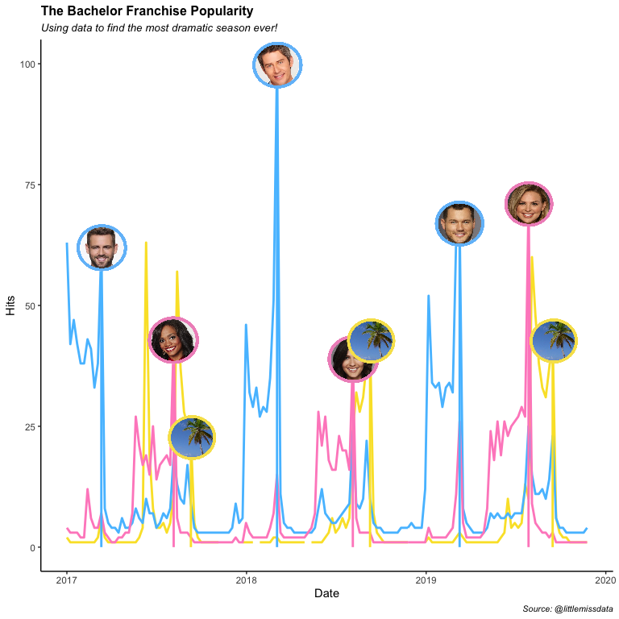

\#Introduction

In this blog post, I will be analyzing the relative popularity of the
bachelor franchise seasons as measured by their google search
popularity.

In this tutorial I will be using the [gtrendsR
package](https://cran.r-project.org/web/packages/gtrendsR/gtrendsR.pdf)
to gather Google trend information, dplyr to format the data, ggplot2 to
create the graphs, gganimate to make an animation and geom\_image to
create custom lollipop charts.

\#Load all of the packages and install if necessary

In my [latest blog post](https://www.littlemissdata.com/blog/iconmap),
someone kindly suggested that I do an auto check to install all
necessary packages before loading them. After a quick search, I found
this code below to efficiently install and load packages in [Vikram
Baliga’s
Blog](https://www.vikram-baliga.com/blog/2015/7/19/a-hassle-free-way-to-verify-that-r-packages-are-installed-and-loaded)

``` r
#specify the packages of interest
packages = c("gtrendsR","tidyverse","gifski", "gganimate", "ggimage", "lubridate")

#use this function to check if each package is on the local machine
#if a package is installed, it will be loaded
#if any are not, the missing package(s) will be installed and loaded
package.check <- lapply(packages, FUN = function(x) {
    if (!require(x, character.only = TRUE)) {
        install.packages(x, dependencies = TRUE)
        library(x, character.only = TRUE)
    }
})
```

    ## Loading required package: gtrendsR

    ## Loading required package: tidyverse

    ## ── Attaching packages ─────────────────────────────────────────────────────────────── tidyverse 1.2.1 ──

    ## ✔ ggplot2 3.2.0     ✔ purrr   0.3.2
    ## ✔ tibble  2.1.3     ✔ dplyr   0.8.3
    ## ✔ tidyr   0.8.3     ✔ stringr 1.4.0
    ## ✔ readr   1.3.1     ✔ forcats 0.4.0

    ## ── Conflicts ────────────────────────────────────────────────────────────────── tidyverse_conflicts() ──
    ## ✖ dplyr::filter() masks stats::filter()
    ## ✖ dplyr::lag()    masks stats::lag()

    ## Loading required package: gifski

    ## Loading required package: gganimate

    ## Loading required package: ggimage

    ## Loading required package: lubridate

    ## 
    ## Attaching package: 'lubridate'

    ## The following object is masked from 'package:base':
    ## 
    ##     date

``` r
#verify they are loaded
search()
```

    ##  [1] ".GlobalEnv"        "package:lubridate" "package:ggimage"  
    ##  [4] "package:gganimate" "package:gifski"    "package:forcats"  
    ##  [7] "package:stringr"   "package:dplyr"     "package:purrr"    
    ## [10] "package:readr"     "package:tidyr"     "package:tibble"   
    ## [13] "package:ggplot2"   "package:tidyverse" "package:gtrendsR" 
    ## [16] "package:stats"     "package:graphics"  "package:grDevices"
    ## [19] "package:utils"     "package:datasets"  "package:methods"  
    ## [22] "Autoloads"         "package:base"

Set the color variables
=======================

To ensure consistent and effective color formatting, I am setting the
color variables up front.

``` r
pink <- "#FF8DC6"
blue <- "#56C1FF"
yellow <- "#FAE232"
```

Gather the ratings data for: The Bachelor, The Bachelorette and Bachelor in Paradise
====================================================================================

Using the gtrendsR package, load weekly US ratings for “Bachelor in
Paradise”, “The Bachelor” and “The Bachelorette”. The hits are
calculated with a relative max of 100 to show the relative max hits over
the time range and search subjects.

Plot the trends with the plot() function.

``` r
bachTrends <- gtrends(c("Bachelor in Paradise", "The Bachelor", "The Bachelorette"), geo ="US")
plot(bachTrends)
```



``` r
bachTrendsInterest <- bachTrends$interest_over_time
```

Transform the data
==================

Filter to data that is 2017+ Convert hits to numeric as the default is
character

``` r
trends <- bachTrendsInterest %>% 
  filter(year(date)>2016) %>% 
  mutate(date = ymd(date),
         hits = as.numeric(hits))
```

    ## Warning: NAs introduced by coercion

Create the same plot with ggplot2
=================================

Create the basic plot of relative search popularity by search critera
with the ggplot2 package. Transitioning to ggplot2 in order to use the
ggplot2 features and complimentary packages like ggimage and gganimate.

``` r
#Frequency plot by keyword
p <- ggplot() + 
  geom_line(data=trends, aes(x=date, y=hits, group=keyword, color = keyword)) + 
  scale_color_manual(values=c( yellow, blue, pink)) +
  theme_classic() +
  theme(legend.position="bottom") +
  labs(title = "The Bachelor Franchise Popularity ",
       subtitle = "Using data to find the most dramatic season ever!",
       caption = "Source: @littlemissdata", 
       x = "Date", y = "Hits") 
p
```



Create an animation
===================

Take the basic plot and make an animation out of it with the gganimate()
package.

``` r
t <- p + 
  transition_reveal(as.numeric(date)) 
gif <- animate(t, end_pause = 25, width = 800, height = 400, fps = 8)
```

    ## Warning: Removed 2 rows containing missing values (geom_path).

    ## Warning: Removed 4 rows containing missing values (geom_path).

    ## Warning: Removed 6 rows containing missing values (geom_path).

    ## Warning: Removed 1 rows containing missing values (geom_path).

    ## Warning: Removed 2 rows containing missing values (geom_path).

    ## Warning: Removed 3 rows containing missing values (geom_path).

    ## Warning: Removed 5 rows containing missing values (geom_path).

``` r
gif
```



``` r
anim_save("Bachelor trends", gif)
```

Bring in meta data about bachelor franchise shows
=================================================

We are going to bring in a data set which has the start dates for every
single season of the Bachelor franchise. We will then do some data
munging to find the closest ratings date to the season start date. With
this info we will join the bachelor season metadata to the ratings
table.

``` r
## Add lollipops
x <-read.csv("https://raw.githubusercontent.com/lgellis/MiscTutorial/master/gtrendsR/bachelorListing.csv", stringsAsFactors = FALSE)

# Turn the dates into proper dates.  
#Ratings are only tracked on sundays so get the closest Sunday for ratings
x <-x %>% 
  mutate(startDate = ymd(as.Date(startDate, "%m/%d/%y")),
         endDate = ymd(as.Date(endDate, "%m/%d/%y")),
         ratingStartDate = floor_date(startDate, "weeks"), 
         ratingEndDate = floor_date(endDate, "weeks"))
x
```

    ##             season                topic  startDate    endDate
    ## 1       Nick Viall         The Bachelor 2017-01-02 2017-03-13
    ## 2 Arie Luyendyk Jr         The Bachelor 2018-01-01 2018-03-06
    ## 3 Colton Underwood         The Bachelor 2019-01-07 2019-03-12
    ## 4   Rachel Lindsay     The Bachelorette 2017-05-22 2017-08-07
    ## 5     Becca Kufrin     The Bachelorette 2018-05-28 2018-08-06
    ## 6     Hannah Brown     The Bachelorette 2019-05-13 2019-07-30
    ## 7         Season 4 Bachelor in Paradise 2017-08-14 2017-09-11
    ## 8         Season 5 Bachelor in Paradise 2018-08-07 2018-09-11
    ## 9         Season 6 Bachelor in Paradise 2019-08-05 2019-09-17
    ##   ratingStartDate ratingEndDate
    ## 1      2017-01-01    2017-03-12
    ## 2      2017-12-31    2018-03-04
    ## 3      2019-01-06    2019-03-10
    ## 4      2017-05-21    2017-08-06
    ## 5      2018-05-27    2018-08-05
    ## 6      2019-05-12    2019-07-28
    ## 7      2017-08-13    2017-09-10
    ## 8      2018-08-05    2018-09-09
    ## 9      2019-08-04    2019-09-15

``` r
#Ratings are typically highest at the beginning
x<-left_join(x, trends, by = c("topic"= "keyword", "ratingEndDate"="date"))
```

Get the images for each of the seasons
======================================

I have some plans to layer on a lollipop graph with the image of the
bachelor season and display it at the height of the number of hits on
the last day of the season. As such, I need to assign an image to every
single season.

``` r
x <-x %>% 
  mutate(Image = case_when(season == "Nick Viall" ~ "https://raw.githubusercontent.com/lgellis/MiscTutorial/master/gtrendsR/images/Nick.png",
                           season == "Arie Luyendyk Jr" ~ "https://raw.githubusercontent.com/lgellis/MiscTutorial/master/gtrendsR/images/Arie.png", 
                           season == "Colton Underwood" ~ "https://raw.githubusercontent.com/lgellis/MiscTutorial/master/gtrendsR/images/Colton.png", 
                           season == "Rachel Lindsay" ~ "https://raw.githubusercontent.com/lgellis/MiscTutorial/master/gtrendsR/images/Rachel.png", 
                           season == "Becca Kufrin" ~ "https://raw.githubusercontent.com/lgellis/MiscTutorial/master/gtrendsR/images/Becca.png", 
                           season == "Hannah Brown" ~ "https://raw.githubusercontent.com/lgellis/MiscTutorial/master/gtrendsR/images/Hannah.png", 
                           topic == "Bachelor in Paradise" ~ "https://raw.githubusercontent.com/lgellis/MiscTutorial/master/gtrendsR/images/BIP.png"))
```

Create the mega chart
=====================

Create a fun graph to display the relative ratings for each season by
layering on a lollipop chart to represent the seasons and their relative
search popularity for the last week of the season. Use the
geom\_segment() function to set the lollipop stem and the geom\_image()
function to set the lolipop circle with the image representing the
season.

``` r
p <- ggplot() + 
  geom_line(data=trends, aes(x=date, y=hits, group=keyword, color = keyword), size=1) + 
  scale_color_manual(values=c(yellow, blue, pink)) +
  geom_segment(data=x, aes(x=ratingEndDate, 
                           xend=ratingEndDate, 
                           y=0, 
                           yend=hits, 
                           color=topic), size=1) +
  geom_image(data=x, aes(x=ratingEndDate, y=hits, image=Image), size=0.105) +
  theme_classic() +
  labs(title = "The Bachelor Franchise Popularity ",
       subtitle = "Using data to find the most dramatic season ever!",
       caption = "Source: @littlemissdata", 
       x = "Date", y = "Hits") +
  theme(legend.position="none",
    plot.title = element_text(size = 12, face = "bold"),
    plot.subtitle = element_text(size=10, face = "italic"),
    plot.caption = element_text(size = 8, face = "italic") )

p
```


