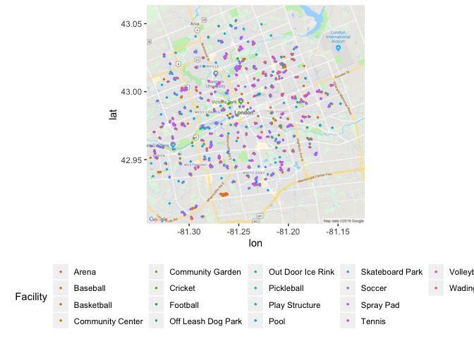
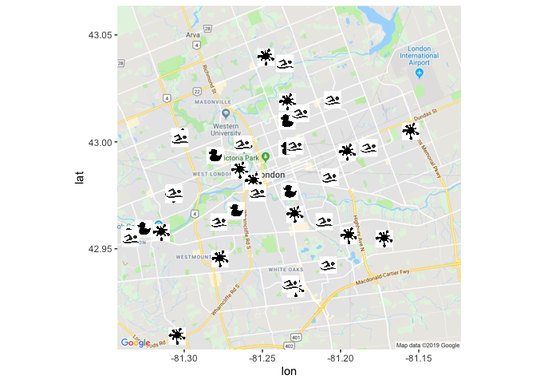
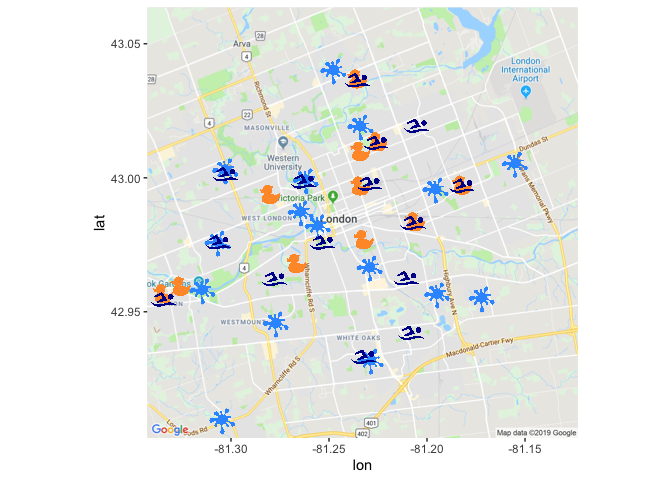
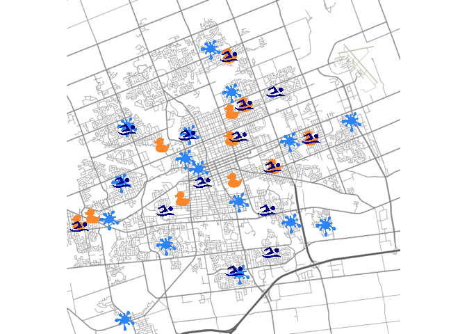
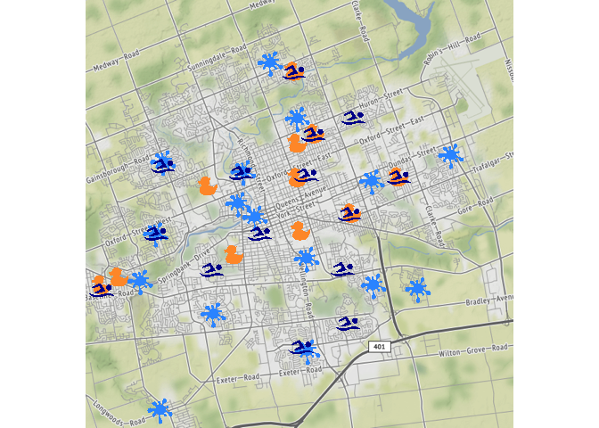

Introduction
------------

Previously I have [written a tutorial on how to use ggmap with R.](https://www.littlemissdata.com/blog/maps) It shows the end to end of how to get started with using ggmaps, including signing up for the google service.

This icon map tutorial is going to extend our ggmap work to create icon maps with ggmap.

Set up packages
---------------

Uncomment any "install.packages()" lines if you also need to install the package.

Download the data
-----------------

I was able to find some neat location information on the [data portal for my home town, London Ontario.](https://www.london.ca/city-hall/open-data/Pages/Open-Data-Data-Catalogue.aspx)

In their catalogue, they have a variety of spreadsheets with location information of public facilities. I downloaded all public facilities of interest, combined and standardized them.

``` r
#Download the data set
df= read_csv('https://raw.githubusercontent.com/lgellis/MiscTutorial/master/iconmap/MasterList.csv', col_names = TRUE)

head(df)
```

    ## # A tibble: 6 x 5
    ##   Facility   Name                            Address      POINT_X   POINT_Y
    ##   <chr>      <chr>                           <chr>        <chr>       <dbl>
    ## 1 Basketball West Lions Park Basketball Cou… 20 Granvill… 478397.4…  4.76e6
    ## 2 Basketball West Lions Park Basketball Cou… 20 Granvill… 478407.7…  4.76e6
    ## 3 Basketball Carling Park Basketball Court … 675 Grosven… 480797.2…  4.76e6
    ## 4 Basketball Carling Park Basketball Court … 675 Grosven… 480791.4…  4.76e6
    ## 5 Basketball Doidge Park Basketball Court #… 300 Cromwel… 479422.6…  4.76e6
    ## 6 Basketball Southeast Optimist Park Basket… 237 Deveron… 484074.2…  4.76e6

``` r
#Set your API Key
#ggmap::register_google(key = "ENTER_YOUR_API_KEY")
```

Convert UTM to lat and long
---------------------------

One thing that really confused me was trying to understand what the x and y coordinates were representing in the open data. After looking at their Q&A I realized that they are in Universal Transverse Mercator (UTM) format.

I found a way to convert UTM to Lat and Long from [stack overflow](https://stackoverflow.com/questions/33456934/lat-long-conversion-to-utm-loop-r-code). I slightly modified the code to run through the whole data set efficiently.

``` r
#Convert UTM to lat/lon

proj4string <- "+proj=utm +zone=17 +north +ellps=WGS84 +datum=NAD83 +units=m +no_defs "
nRow <- nrow(df)
df$Lat <-0
df$Lon <-0


for(i in 1:nRow){
  temp <-project(df[i,4:5], proj4string, inverse=TRUE)
  df[i,6] <- temp$y
  df[i,7] <-temp$x
}

head(df,60)
```

    ## # A tibble: 60 x 7
    ##    Facility  Name                   Address    POINT_X  POINT_Y   Lat   Lon
    ##    <chr>     <chr>                  <chr>      <chr>      <dbl> <dbl> <dbl>
    ##  1 Basketba… West Lions Park Baske… 20 Granvi… 478397.…  4.76e6  43.0 -81.3
    ##  2 Basketba… West Lions Park Baske… 20 Granvi… 478407.…  4.76e6  43.0 -81.3
    ##  3 Basketba… Carling Park Basketba… 675 Grosv… 480797.…  4.76e6  43.0 -81.2
    ##  4 Basketba… Carling Park Basketba… 675 Grosv… 480791.…  4.76e6  43.0 -81.2
    ##  5 Basketba… Doidge Park Basketbal… 300 Cromw… 479422.…  4.76e6  43.0 -81.3
    ##  6 Basketba… Southeast Optimist Pa… 237 Dever… 484074.…  4.76e6  43.0 -81.2
    ##  7 Basketba… St. Stephen's Park Ba… 1030 Mitc… 481777.…  4.75e6  42.9 -81.2
    ##  8 Basketba… Westminster Optimist … 650 Osgoo… 483116.…  4.75e6  42.9 -81.2
    ##  9 Basketba… Huron Heights Park Ba… 185 McNay… 481821.…  4.76e6  43.0 -81.2
    ## 10 Basketba… Culver Park Basketbal… 1735 Culv… 485117.…  4.76e6  43.0 -81.2
    ## # … with 50 more rows

Create the starting map
-----------------------

I start out with a basic map plotting all amenities, colored by facility type. For more information on the basics of ggmap, please see this [tutorial](https://www.littlemissdata.com/blog/maps).

``` r
p <- ggmap(get_googlemap(center = c(lon =-81.23304, lat = 42.98339),
                    zoom = 12, scale = 2,
                    maptype ='roadmap',
                    color = 'color'))
p + geom_point(aes(x = Lon, y = Lat,  colour = Facility), data = df, size = 0.5) + 
  theme(legend.position="bottom")
```



Filter and plot an icon map
---------------------------

Filter to only include water facilities (pool, wading pool, spray pad).

Assign and display the icon for each facility type.

``` r
df2 <-df %>% 
  filter(Facility %in% c("Pool", "Wading Pool", "Spray Pad")) %>% 
  mutate(Image = case_when(Facility == "Pool" ~ "https://raw.githubusercontent.com/lgellis/MiscTutorial/master/iconmap/swimmer.png",
                           Facility == "Wading Pool" ~ "https://raw.githubusercontent.com/lgellis/MiscTutorial/master/iconmap/duckie.png", 
                           Facility == "Spray Pad" ~ "https://raw.githubusercontent.com/lgellis/MiscTutorial/master/iconmap/splash.png"))

p + geom_image(aes(x = Lon, y = Lat, image=Image), data = df2, size = 0.05) + 
  theme(legend.position="bottom")  
```



Make the images more aesthetically pleasing.
--------------------------------------------

Make all images transparent, save and re-upload to GH

Use the "Magick" package to make each image transparent with image\_transparent(). Make the resulting image a specific color with image\_colorize().

I then saved the images using the image\_write() function. I manually re-uploaded them to GH.

``` r
baby <-image_transparent(image_read("https://raw.githubusercontent.com/lgellis/MiscTutorial/master/iconmap/duckie.png"), 'white')
baby <- image_colorize(baby, 100, "#FF9933")
image_write(baby, path = "babyPoolFinal.png", format = "png")

swimmer <-image_transparent(image_read("https://raw.githubusercontent.com/lgellis/MiscTutorial/master/iconmap/swimmer.png"), 'white')
swimmer <- image_colorize(swimmer, 100, "#000099")
image_write(swimmer, path = "swimmerFinal.png", format = "png")

splash <-image_transparent(image_read("https://raw.githubusercontent.com/lgellis/MiscTutorial/master/iconmap/splash.png"), 'white')
splash <- image_colorize(splash, 100, "#3399FF")
image_write(splash, path = "splashFinal.png", format = "png")
```

Create a better map using the newly formatted icons
---------------------------------------------------

Create a new icon map using the new images as the icons.

``` r
df2 <-df %>% 
  filter(Facility %in% c("Pool", "Wading Pool", "Spray Pad")) %>% 
  mutate(Image = case_when(Facility == "Pool" ~ "https://raw.githubusercontent.com/lgellis/MiscTutorial/master/iconmap/swimmerFinal.png",
                           Facility == "Wading Pool" ~ "https://raw.githubusercontent.com/lgellis/MiscTutorial/master/iconmap/babyPoolFinal.png", 
                           Facility == "Spray Pad" ~ "https://raw.githubusercontent.com/lgellis/MiscTutorial/master/iconmap/splashFinal.png"))

p + geom_image(aes(x = Lon, y = Lat, image=Image), data = df2, size = 0.06) + 
  theme(legend.position="bottom") 
```



Create a different version using 'stamen' and 'terrain-lines'
-------------------------------------------------------------

Now that we’ve sorted out our icons and have them plotted on the map, let’s try swapping out the base map. We are going to try the 'stamen' 'terrain-lines' version. I think that this a really cool way of looking at it as it represents the subdivisions more clearly.

For more information on swapping out base plots, please see my previous [tutorial](https://www.littlemissdata.com/blog/maps).

``` r
center = c(lon =-81.23304, lat = 42.98339)
qmap(center, zoom = 12, source = "stamen", maptype = "terrain-lines") +
  geom_image(aes(x = Lon, y = Lat, image=Image), data = df2, size = 0.06) + 
  theme(legend.position="bottom") 
```



Create a better version using 'stamen' and 'terrain'
----------------------------------------------------

Now swap out 'terrain-lines' mapping parameter for 'terrain'. I think this is my favorite version as it nicely balances showing green space and street lines very clearly at a distance.

``` r
center = c(lon =-81.23304, lat = 42.98339)
qmap(center, zoom = 12, source = "stamen", maptype = "terrain") +
  geom_image(aes(x = Lon, y = Lat, image=Image), data = df2, size = 0.06) + 
  theme(legend.position="bottom") 
```



``` r
sessionInfo() 
```

    ## R version 3.5.2 (2018-12-20)
    ## Platform: x86_64-apple-darwin15.6.0 (64-bit)
    ## Running under: macOS Mojave 10.14.6
    ## 
    ## Matrix products: default
    ## BLAS: /Library/Frameworks/R.framework/Versions/3.5/Resources/lib/libRblas.0.dylib
    ## LAPACK: /Library/Frameworks/R.framework/Versions/3.5/Resources/lib/libRlapack.dylib
    ## 
    ## locale:
    ## [1] en_US.UTF-8/en_US.UTF-8/en_US.UTF-8/C/en_US.UTF-8/en_US.UTF-8
    ## 
    ## attached base packages:
    ## [1] stats     graphics  grDevices utils     datasets  methods   base     
    ## 
    ## other attached packages:
    ##  [1] ggimage_0.2.2   ggmap_3.0.0     magick_2.1      proj4_1.0-8    
    ##  [5] forcats_0.4.0   stringr_1.4.0   dplyr_0.8.3     purrr_0.3.2    
    ##  [9] readr_1.3.1     tidyr_0.8.3     tibble_2.1.3    ggplot2_3.2.0  
    ## [13] tidyverse_1.2.1
    ## 
    ## loaded via a namespace (and not attached):
    ##  [1] tidyselect_0.2.5   xfun_0.8           haven_2.1.0       
    ##  [4] lattice_0.20-38    vctrs_0.1.0        colorspace_1.4-1  
    ##  [7] generics_0.0.2     htmltools_0.3.6    yaml_2.2.0        
    ## [10] utf8_1.1.4         gridGraphics_0.4-1 rlang_0.4.0       
    ## [13] pillar_1.4.1       glue_1.3.1         withr_2.1.2       
    ## [16] modelr_0.1.4       readxl_1.3.1       rvcheck_0.1.3     
    ## [19] plyr_1.8.4         jpeg_0.1-8         munsell_0.5.0     
    ## [22] gtable_0.3.0       cellranger_1.1.0   rvest_0.3.4       
    ## [25] RgoogleMaps_1.4.3  evaluate_0.14      labeling_0.3      
    ## [28] knitr_1.23         curl_3.3           fansi_0.4.0       
    ## [31] broom_0.5.2        Rcpp_1.0.2         scales_1.0.0      
    ## [34] backports_1.1.4    jsonlite_1.6       rjson_0.2.20      
    ## [37] hms_0.4.2          png_0.1-7          digest_0.6.20     
    ## [40] stringi_1.4.3      grid_3.5.2         cli_1.1.0         
    ## [43] tools_3.5.2        bitops_1.0-6       magrittr_1.5      
    ## [46] lazyeval_0.2.2     zeallot_0.1.0      crayon_1.3.4      
    ## [49] pkgconfig_2.0.2    ggplotify_0.0.4    xml2_1.2.0        
    ## [52] lubridate_1.7.4    assertthat_0.2.1   rmarkdown_1.13    
    ## [55] httr_1.4.0         rstudioapi_0.10    R6_2.4.0          
    ## [58] nlme_3.1-140       compiler_3.5.2
