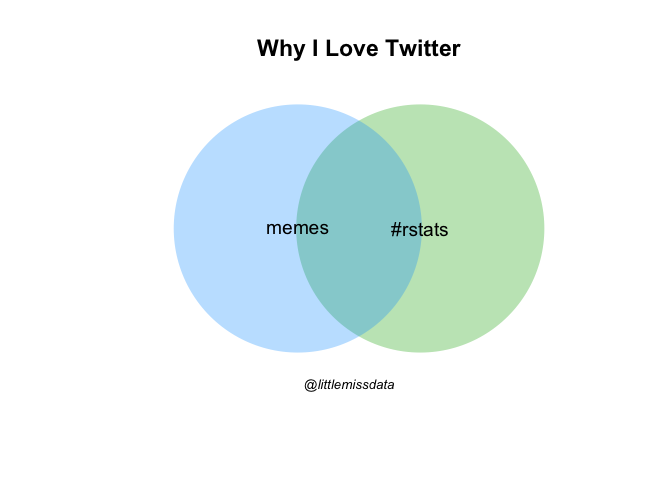
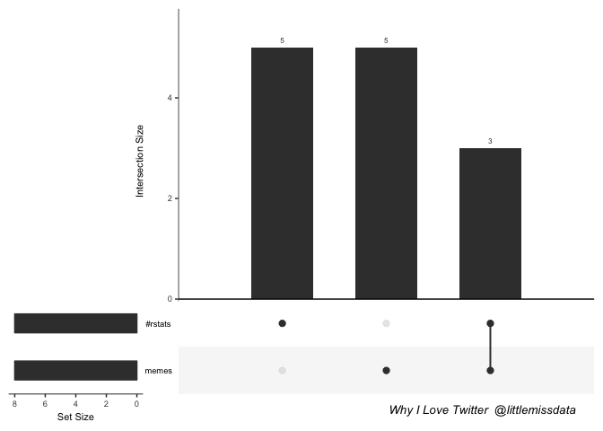
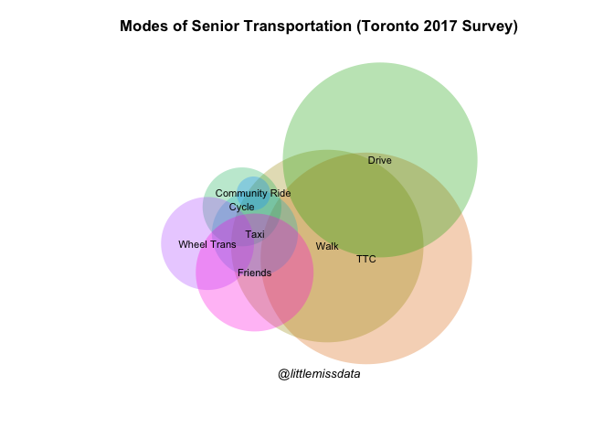
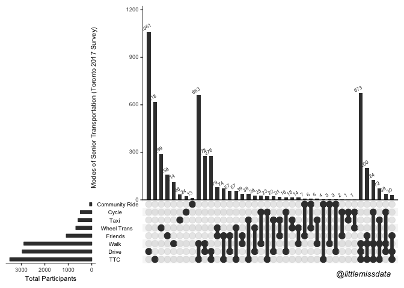
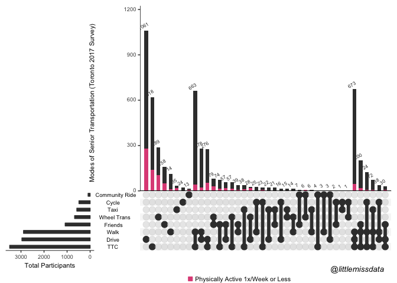
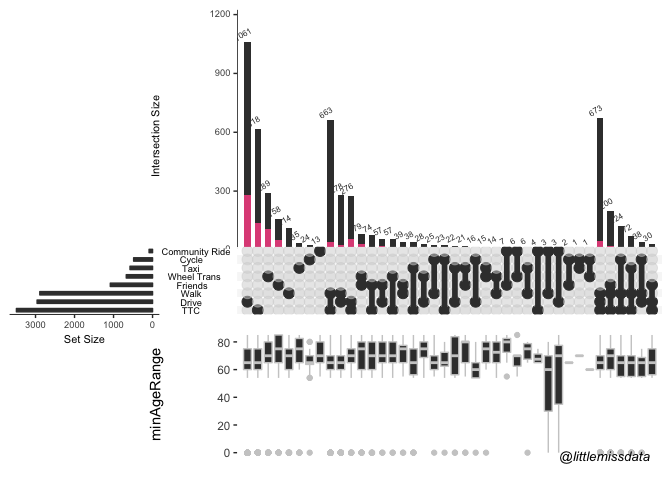
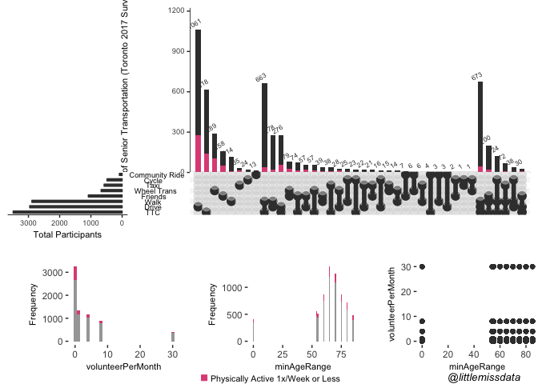
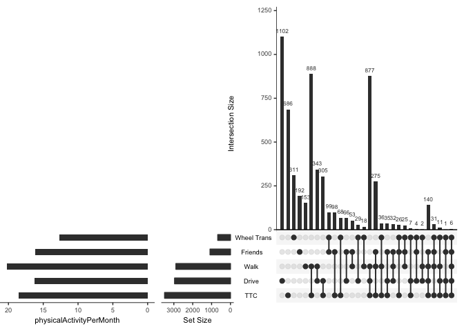

Please note that the full tutorial with context can be found on [my blog](https://www.littlemissdata.com/blog/set-analysis)

Install and Load Packages
=========================

Before we get going, we will install and load all required packages. Please uncomment any lines that contain packages which you don't already have.

Important notes about venneuler java use.
- As far as I can tell, [the venneuler package](https://cran.r-project.org/web/packages/UpSetR/vignettes/basic.usage.html) does not work with Java v12.
- If you have [v11 JDK](https://www.oracle.com/technetwork/java/javase/downloads/jdk11-downloads-5066655.html) installed and you still have issues, please see this [troubleshooting issue.](https://github.com/s-u/rJava/issues/151).

Round 1: Tiny and Fun Set Intersection
======================================

Venn diagrams are fun, so let's start with that!

Assign the Set Sizing
---------------------

``` r
# Data
expressionInput <- c(`#rstats` = 5, memes = 5, `#rstats&memes` = 3)
```

Create a Venn Diagram
---------------------

``` r
# Venn
# note on set up for java v11 jdk (v12 does not work with this)
myExpVenn <- venneuler(expressionInput)
par(cex=1.2)
plot(myExpVenn, main = "Why I Love Twitter")
grid.text(
  "@littlemissdata",
  x = 0.52,
  y = 0.2,
  gp = gpar(
    fontsize = 10,
    fontface = 3
  )
)
```



Create an UpsetR Chart
----------------------

To orient yourself to the chart, note that the overall count is in the horizontal bar on the left hand side. The individual set counts represent the bar. For example, the \#rstats set has 8 total, 3 overlapping with the meme set and 5 belonging just to the \#rstats set.

I think UpsetR is a great way to easily parse through the relative sizes of the sets.

``` r
# UpsetR
upset(fromExpression(expressionInput), order.by = "freq")
grid.text(
  "Why I Love Twitter  @littlemissdata",
  x = 0.80,
  y = 0.05,
  gp = gpar(
    fontsize = 10,
    fontface = 3
  )
) # created the label via grid.text with hack found here: https://github.com/hms-dbmi/UpSetR/issues/76
```



Round 2: Complicated Sets
=========================

Bring in Data
-------------

The data set we are going to work with is about 7K records and it is based on the [2017 Toronto Senior Survey](https://www.toronto.ca/city-government/data-research-maps/open-data/open-data-catalogue/community-services/#9ece3c85-08c9-097d-f4c8-bb7374fea6c1) from the [Toronto Open Data Catalogue](Open%20Data%20Catalogue). Having lived in Toronto for 10 years, I'm so happy that they have created an open data portal. You have to give the data to the people that pay for it! I also love that Toronto is invested in the senior community and actively monitoring their quality of life.

I have taken the original data set and stripped it down to include general questions relating to the person as well as transportation questions. I removed the mostly blank rows and renamed the columns. Below is the mapping and data dictionary.

<table style="width:39%;">
<colgroup>
<col width="19%" />
<col width="19%" />
</colgroup>
<thead>
<tr class="header">
<th>Column</th>
<th>Source Column</th>
</tr>
</thead>
<tbody>
<tr class="odd">
<td>ID</td>
<td>Not previously included. This is a new unique key column.</td>
</tr>
<tr class="even">
<td>physicalActivity</td>
<td>Survey Question: &quot;1. In the past 3 months, how often did you participate in physical activities like walking?&quot;</td>
</tr>
<tr class="odd">
<td>physicalActivityPerMonth</td>
<td>Survey Question: &quot;1. In the past 3 months, how often did you participate in physical activities like walking?&quot;. This has been transformed into numerical format.</td>
</tr>
<tr class="even">
<td>volunteerParticipation</td>
<td>Survey Question: &quot;5. During the past 3 months, how often did you participate in volunteer or charity work?&quot;</td>
</tr>
<tr class="odd">
<td>volunteerPerMonth</td>
<td>Survey Question: &quot;5. During the past 3 months, how often did you participate in volunteer or charity work?&quot;. This has been transformed into numerical format.</td>
</tr>
<tr class="even">
<td>difficultFinancial</td>
<td>Survey Question: &quot;9. In the last year, have you had difficulty paying your rent, mortgage, Hydro bill, or other housing costs? For example, have you had to go without groceries to pay for rent or other monthly housing expenses?&quot;</td>
</tr>
<tr class="odd">
<td>supportSystem</td>
<td>Survey Question: &quot;13. Do you have people in your life who you can call on for help if you need it?&quot;</td>
</tr>
<tr class="even">
<td>postalCode</td>
<td>&quot;Survey Question: 14. What are the first three characters of your postal code?&quot;</td>
</tr>
<tr class="odd">
<td>employmentStatus</td>
<td>Survey Question: &quot;15. What is your current employment status?&quot;</td>
</tr>
<tr class="even">
<td>sex</td>
<td>Survey Question: &quot;16. What is your sex/gender?&quot;</td>
</tr>
<tr class="odd">
<td>primaryLanguage</td>
<td>Survey Question: &quot;18. In what language(s) would you feel most comfortable to receive services?&quot; (first option listed)</td>
</tr>
<tr class="even">
<td>ageRange</td>
<td>Survey Question: &quot;19. Which age category do you belong to?&quot;</td>
</tr>
<tr class="odd">
<td>ttcTransportation</td>
<td>Survey Question: &quot;6. To get around Toronto, what modes of transportation do you use frequently? [TTC (bus, subway, or streetcar)]&quot;</td>
</tr>
<tr class="even">
<td>walkTransportation</td>
<td>Survey Question: &quot;6. To get around Toronto, what modes of transportation do you use frequently? [Walk]&quot;</td>
</tr>
<tr class="odd">
<td>driveTransportation</td>
<td>Survey Question: &quot;6. To get around Toronto, what modes of transportation do you use frequently? [Drive]&quot;</td>
</tr>
<tr class="even">
<td>cycleTransportation</td>
<td>Survey Question: &quot;6. To get around Toronto, what modes of transportation do you use frequently? [Cycle]&quot;</td>
</tr>
<tr class="odd">
<td>taxiTransportation</td>
<td>Survey Question: &quot; 6. To get around Toronto, what modes of transportation do you use frequently? [Taxi or Uber]&quot;</td>
</tr>
<tr class="even">
<td>communityRideTransportation</td>
<td>Survey Question: &quot;6. To get around Toronto, what modes of transportation do you use frequently? [Community Transportation Program, for example Toronto Ride or iRIDE]&quot;</td>
</tr>
<tr class="odd">
<td>wheelTransTransportation</td>
<td>Survey Question: &quot;6. To get around Toronto, what modes of transportation do you use frequently? [Wheel-Trans]&quot;</td>
</tr>
<tr class="even">
<td>friendsTransportation</td>
<td>Survey Question: &quot;6. To get around Toronto, what modes of transportation do you use frequently? [Rides from family, friends or neighbours]&quot;</td>
</tr>
<tr class="odd">
<td>ageRange</td>
<td>Survey Question: &quot;19. Which age category do you belong to?&quot;.</td>
</tr>
<tr class="even">
<td>minAgeRange</td>
<td>Survey Question: &quot;19. Which age category do you belong to?&quot;. This has been converted to numerical format, taking the lowest age as the value.</td>
</tr>
</tbody>
</table>

``` r
rawSets <- read.csv(
  file = "https://raw.githubusercontent.com/lgellis/MiscTutorial/master/sets/seniorTransportation.csv",
  header = TRUE, sep = ",", stringsAsFactors = FALSE
)

# Some formatting

# Replace the NA's
rawSets[is.na(rawSets)] <- 0


# Rename the columns for easier display
sets <- rawSets %>%
  rename(TTC = ttcTransportation, Walk = walkTransportation, Drive = driveTransportation, Cycle = cycleTransportation, Taxi = taxiTransportation, `Community Ride` = communityRideTransportation, `Wheel Trans` = wheelTransTransportation, Friends = friendsTransportation)

dim(sets)
```

    ## [1] 6239   21

``` r
head(sets)
```

    ##   ID physicalActivity physicalActivityPerMonth volunteerParticipation
    ## 1  1            Never                        0                       
    ## 2  2            Never                        0                  Never
    ## 3  3            Never                        0                  Never
    ## 4  4            Never                        0                  Never
    ## 5  5            Never                        0  At least once a month
    ## 6  6            Never                        0  At least once a month
    ##   volunteerPerMonth TTC Walk Drive Cycle Taxi Community Ride Wheel Trans
    ## 1                 0   0    0     1     0    0              0           0
    ## 2                 0   0    0     1     0    0              0           0
    ## 3                 0   0    0     1     0    0              0           0
    ## 4                 0   0    0     1     0    0              0           0
    ## 5                 1   0    0     1     0    0              0           0
    ## 6                 1   1    0     0     0    0              0           0
    ##   Friends difficultFinancial supportSystem postalCode
    ## 1       0                 No           Yes        L1X
    ## 2       0                 No           Yes        L3R
    ## 3       0                 No            No        L4Z
    ## 4       0                 No           Yes        L5N
    ## 5       0                 No            No        l5R
    ## 6       0                 No           Yes    L-T -G-
    ##               employmentStatus    sex primaryLanguage           ageRange
    ## 1                      Retired Female         English        65-69 years
    ## 2                      Retired   Male                        65-69 years
    ## 3 Unemployed, looking for work   Male         English        65-69 years
    ## 4           Employed full-time   Male         English        55-59 years
    ## 5           Employed full-time Female                 Less than 54 years
    ## 6           Employed full-time Female         Spanish        55-59 years
    ##   minAgeRange
    ## 1          65
    ## 2          65
    ## 3          65
    ## 4          55
    ## 5          54
    ## 6          55

Create a Venn Diagram
---------------------

### Prep the Data for a Venn Diagram

Venneuler takes data in the form of a two column data frame. The first column represents the record identifier, and the second column represents the set to include it in. Therefore, we may have records with the same identifier repeated multiple times for every set they are part of.

``` r
vennSets <- sets %>%
  gather(transportation, binary,6:13) %>% # take all binary mappings and convert to be a the set indicator
  filter(binary == 1) %>% # only include set matches
  select(ID, transportation) %>% # only include ID and set category
  mutate(transportation = factor(transportation)) # set the transportation column as a factor

dim(vennSets)
```

    ## [1] 12249     2

### Plot the Venn Diagram

``` r
v <- venneuler(data.frame(vennSets))

#Note that if you need to move around the labels so that they are not overlapping, you can use the new line breaks like the example below.
#v$labels <- c("TTC", "Walk", "Drive", "Cycle\n\n\n", "\nTaxi", "Community Ride", "Wheel Trans", "Friends")

par(cex = 0.7) 
plot(v, main = "Modes of Senior Transportation (Toronto 2017 Survey)", cex.main = 1.5)
grid.text(
  "@littlemissdata",
  x = 0.52,
  y = 0.15,
  gp = gpar(
    fontsize = 10,
    fontface = 3
  )
)
```



Plot the UpsetR Chart
---------------------

There is no need to reformat the data because it is already in the form of a binary matrix. If your data was in the form of a list such as above, you could transform it to a matrix using dplyr. I did this previously by adding a helper column to set the binary value as 1 for all rows in the list. You can then spread the column to create the binary matrix. You will also need to replace the NA's with 0's. In this case, the code would be as follows.

      sets %>% 
      add_column(ID=1) %>% #a helper column for the spread
      spread (transportation, ID) #spread the data to binary columns
      
      #NA replacement
      sets[is.na(sets)] <- 0

``` r
upset(sets,
  nsets = 10, number.angles = 30, point.size = 3.5, line.size = 2,
  mainbar.y.label = "Modes of Senior Transportation (Toronto 2017 Survey)", sets.x.label = "Total Participants"
)
grid.text(
  "@littlemissdata",
  x = 0.90,
  y = 0.05,
  gp = gpar(
    fontsize = 10,
    fontface = 3
  )
)
```



Round 3: Exploring Information About the Sets!
==============================================

Now that we've visualized the relative sizes of the sets and their intersection, we may care to know more about the sets.

Explore Extra Context Within a Venn Diagram
-------------------------------------------

Not available. This is the point in our journey when venn diagrams start to fall out of the competition. While there are a few things that we could do to bring in context about other areas of the data set, they are not great options. For example, we could shade the circles according to an aggregate value of another column (ie % working), but it would likely be difficult to digest and not worth the effort.

### Explore Extra Context Within an UpsetR Chart

#### Highlight Focus Areas Within Chart With "Queries""

A [query](https://cran.r-project.org/web/packages/UpSetR/vignettes/queries.html) is simply a subset of the data that you want to highlight or reference later. The graph may contain multiple queries and that is why the queries are defined in a list.

**Highlight Seniors Who Both Walk and Cycle Using "Query=Intersects"**

We will highlight all active seniors by looking for the intersection of "Cycle" and "Walk" transportation modes.

``` r
upset(sets,
  query.legend = "bottom", nsets = 10, number.angles = 30, point.size = 3.5, line.size = 2,
  mainbar.y.label = "Modes of Senior Transportation (Toronto 2017 Survey)", sets.x.label = "Total Participants", 
  queries = list(
  list(
    query = intersects,
    params = list("Cycle", "Walk"), 
    color = "#Df5286", 
    active = T,
    query.name = "Physically Active Transportation"
  )
  )
)
grid.text(
  "@littlemissdata",
  x = 0.90,
  y = 0.05,
  gp = gpar(
    fontsize = 10,
    fontface = 3
  )
)
```


**Highlight Seniors Who Exercise 1x/Week or Less Using "Query=Elements"**

``` r
upset(sets,
  query.legend = "bottom", nsets = 10, number.angles = 30, point.size = 3.5, line.size = 2,
  mainbar.y.label = "Modes of Senior Transportation (Toronto 2017 Survey)", sets.x.label = "Total Participants", 
  queries = list(
  list(
    query = elements,
    params = list("physicalActivityPerMonth", 0,4),
    color = "#Df5286", 
    active = T,
    query.name = "Physically Active 1x/Week or Less"
  )
  )
)
grid.text(
  "@littlemissdata",
  x = 0.90,
  y = 0.05,
  gp = gpar(
    fontsize = 10,
    fontface = 3
  )
)
```



### Provide Context with Additional Graphs Called "Attribute Plots"

**Display an in context box plot of age for each set using boxplot.summary() function **

Attribute plots are an awesome way of displaying information about the rest of the data set within the context of the sets or the queries previously defined. More information can be found in the [excellent package tutorial.](https://cran.r-project.org/web/packages/UpSetR/vignettes/queries.html)

Note that you can adjust the graph ratios with the function: `mb.ratio() function`

``` r
upset(sets,
  query.legend = "bottom", nsets = 10, number.angles = 30, point.size = 3.5, line.size = 2,  
  queries = list(
  list(
    query = elements,
    params = list("physicalActivityPerMonth", 0,4),
    color = "#Df5286", 
    active = T,
    query.name = "Physically Active 1x/Week or Less"
  )
  ), 
  boxplot.summary = c("minAgeRange")
)
grid.text(
  "@littlemissdata",
  x = 0.90,
  y = 0.05,
  gp = gpar(
    fontsize = 10,
    fontface = 3
  )
)
```



**Using "Attribute Plots" Display In-Context Aggregate Statistics for Other Columns and Highlight with Existing Queries**

We can use histograms, scatter plots etc.

``` r
upset(sets,
  query.legend = "bottom", nsets = 10, number.angles = 30, point.size = 3.5, line.size = 2,
  mainbar.y.label = "Modes of Senior Transportation (Toronto 2017 Survey)", sets.x.label = "Total Participants", 
  queries = list(
  list(
    query = elements,
    params = list("physicalActivityPerMonth", 0,4),
    color = "#Df5286", 
    active = T,
    query.name = "Physically Active 1x/Week or Less"
  )
  ), 
  attribute.plots = list(gridrows = 50, 
    plots = list(list(plot = histogram, x = "volunteerPerMonth", queries = T), 
                 list(plot = histogram, x = "minAgeRange", queries = T), 
                 list(plot = scatter_plot, x = "minAgeRange", y="volunteerPerMonth", queries = F)
  ), 
ncols = 3
) 
)
grid.text(
  "@littlemissdata",
  x = 0.9,
  y = 0.02,
  gp = gpar(
    fontsize = 10,
    fontface = 3
  )
)
```



### Display Information About the Categories With "Set Metadata"

Metadata is a great way of displaying information about the core sets, not including intersections. You can find out more information in the great package documentation [here](https://cran.r-project.org/web/packages/UpSetR/vignettes/set.metadata.plots.html). There are essentially two steps: - Prepare the metadata - before any summarization is displayed, we need to create a data frame which contains the summary statistics about the sets that we want to display. - Display the metadata graphs - self explanatory.

#### Prepare the Metadata

``` r
aggregate <- sets %>% 
  gather(transportation, binary,6:13) %>% 
  filter(binary == 1) %>% # only include set matches
  group_by(transportation) %>%  #get summary stats per transportation category
  summarize(physicalActivityPerMonth = mean(physicalActivityPerMonth))
  
aggregate
```

    ## # A tibble: 8 x 2
    ##   transportation physicalActivityPerMonth
    ##   <chr>                             <dbl>
    ## 1 Community Ride                     14.0
    ## 2 Cycle                              22.9
    ## 3 Drive                              16.2
    ## 4 Friends                            16.1
    ## 5 Taxi                               17.3
    ## 6 TTC                                18.5
    ## 7 Walk                               20.2
    ## 8 Wheel Trans                        12.7

#### Display the Metadata

``` r
upset(sets, set.metadata = list(data = aggregate, plots = list(list(type = "hist", 
    column = "physicalActivityPerMonth", assign = 50))))
```



``` r
sessionInfo() 
```

    ## R version 3.5.2 (2018-12-20)
    ## Platform: x86_64-apple-darwin15.6.0 (64-bit)
    ## Running under: macOS High Sierra 10.13.6
    ## 
    ## Matrix products: default
    ## BLAS: /Library/Frameworks/R.framework/Versions/3.5/Resources/lib/libRblas.0.dylib
    ## LAPACK: /Library/Frameworks/R.framework/Versions/3.5/Resources/lib/libRlapack.dylib
    ## 
    ## locale:
    ## [1] en_US.UTF-8/en_US.UTF-8/en_US.UTF-8/C/en_US.UTF-8/en_US.UTF-8
    ## 
    ## attached base packages:
    ## [1] grid      stats     graphics  grDevices utils     datasets  methods  
    ## [8] base     
    ## 
    ## other attached packages:
    ##  [1] venneuler_1.1-0 forcats_0.3.0   stringr_1.4.0   dplyr_0.8.0.1  
    ##  [5] purrr_0.3.2     readr_1.2.1     tidyr_0.8.2     tibble_2.1.1   
    ##  [9] ggplot2_3.1.1   tidyverse_1.2.1 UpSetR_1.3.3    rJava_0.9-11   
    ## 
    ## loaded via a namespace (and not attached):
    ##  [1] tidyselect_0.2.5 xfun_0.6         haven_2.0.0      lattice_0.20-38 
    ##  [5] colorspace_1.4-1 generics_0.0.2   htmltools_0.3.6  yaml_2.2.0      
    ##  [9] utf8_1.1.4       rlang_0.3.4      pillar_1.3.1     glue_1.3.1      
    ## [13] withr_2.1.2      modelr_0.1.2     readxl_1.1.0     plyr_1.8.4      
    ## [17] munsell_0.5.0    gtable_0.3.0     cellranger_1.1.0 rvest_0.3.2     
    ## [21] evaluate_0.13    labeling_0.3     knitr_1.22       fansi_0.4.0     
    ## [25] broom_0.5.1      Rcpp_1.0.1       scales_1.0.0     backports_1.1.4 
    ## [29] jsonlite_1.6     gridExtra_2.3    hms_0.4.2        digest_0.6.18   
    ## [33] stringi_1.4.3    cli_1.1.0        tools_3.5.2      magrittr_1.5    
    ## [37] lazyeval_0.2.2   crayon_1.3.4     pkgconfig_2.0.2  xml2_1.2.0      
    ## [41] lubridate_1.7.4  assertthat_0.2.1 rmarkdown_1.11   httr_1.4.0      
    ## [45] rstudioapi_0.9.0 R6_2.4.0         nlme_3.1-137     compiler_3.5.2
